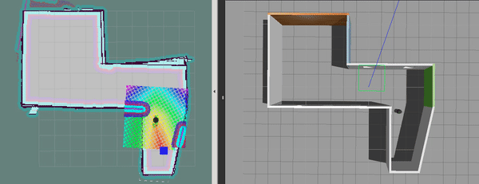
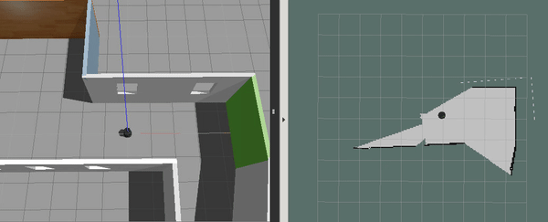
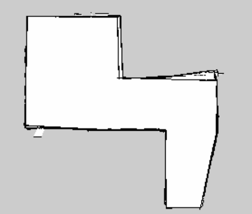
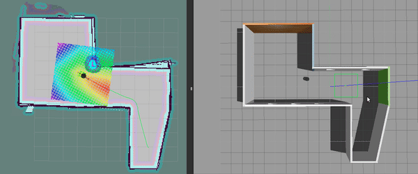
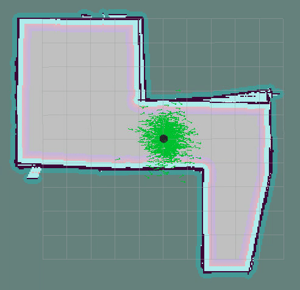

# Udacity-RoboND-Home-Service-Robot


This project was developed on Ubuntu 16.04 LTS with ROS Kinetic, Gazebo and catkin installed.

## Preliminary Steps
1. clone this project  
This project requires following ROS packages: ``turtlebot_gazebo``, ``gmapping`` , ``turtlebot_rviz_launchers`` and ``turtlebot_teleop`` 
Those ROS packages are added as submodules, follow steps below to initialize.
2. submodule initialization  
  ``git submodule init``  
3. submodule update  
  ``git submodule update``
4. open ``Udacity-RoboND-Home-Service-Robot`` with Terminal   
  ``catkin_make``  
5. switch pkg``slam_gmapping`` branch to ``hydro-devel``
  ``git checkout -b hydro-devel origin/hydro-devel`` 
  
 ## Dependencies
* xterm  
``sudo apt-get install xterm``  
* ROS packages
open project in terminal  
``source devel/setup.bash``  
``rosdep -i install turtlebot_gazebo``  
``rosdep -i install gmapping``  
``rosdep -i install turtlebot_rviz_launchers``  
``rosdep -i install turtlebot_teleop``  

### Mapping


1. Open ``Udacity-RoboND-Home-Service-Robot/Shell`` in Terminal  

2. give it ``execute`` pemission by ``chmod +x test_slam.sh``  

3. ``./test_slam.sh``  

4. generated pgm file:  



### Localization and Navigation
  

1. Open ``Udacity-RoboND-Home-Service-Robot/Shell`` in Terminal  

2. give it ``execute`` pemission by ``chmod +x pick_object.sh``  

3. ``./pick_object.sh``  

### Home Service Functions
#### Add Markers 
  

1. Open ``Udacity-RoboND-Home-Service-Robot/Shell`` in Terminal  

2. give it ``execute`` pemission by ``chmod +x add_markers.sh``  

3. ``./add_markers.sh``  

#### Home Service  
  

1. give it ``execute`` pemission by ``chmod +x home_service.sh``  
2. ``./home_servicem.sh``  
* ``home_servicem.sh`` launches ``turtlebot``, ``AMCL``, ``rviz``, ``pcik_objects`` and ``add_markers_hsr`` nodes  
* rviz config file: ``home_service.rviz`` modifiy it path in ``/shell/home_service.sh`` line 6  
```
#!/bin/sh
xterm  -e  "source devel/setup.bash; roslaunch turtlebot_gazebo turtlebot_world.launch world_file:=/home/workspace/HSR/src/world/my_world.world" &
sleep 10
xterm  -e  "source devel/setup.bash; roslaunch turtlebot_gazebo amcl_demo.launch map_file:=/home/workspace/HSR/src/world/map.yaml" & 
sleep 5
xterm  -e  "source devel/setup.bash; rosrun rviz rviz -d /home/workspace/Udacity-RoboND-Home-Service-Robot/home_service.rviz" &
sleep 10
xterm  -e  "source devel/setup.bash; rosrun add_markers add_markers_hsr" &
sleep 1
xterm  -e  "source devel/setup.bash; rosrun pick_objects pick_objects" 
```
